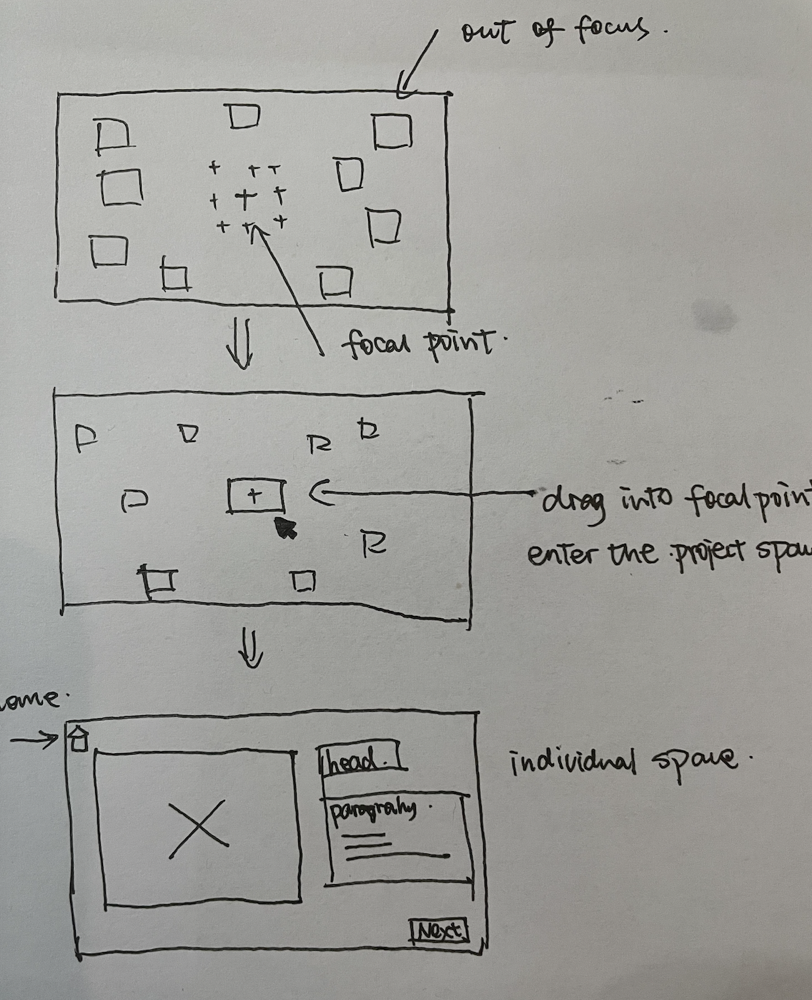

# ConnectionLab_project1
link: https://ada-fun31.github.io/ConnectionLab_project1/Framework_project_1/

### Initial Ideas
1. create a distorted / hard to read framework (it does not require much of "design elements" tbh)
2. commercial page / use it for self-promotion for sure

### Bit of research (of course
interactivity：
1. https://banjosoundscapes.com/  
   "banjo music studio" This is one of the websites I encoutered at work that had really impressed me. The interface itself introduces a fun experience of
   making good sound and literally anyone can use the interface to make nice melody.
3. https://hiradsab.com/  
   protfolio site from my undergrad instructor Hirad Sab  
   click into the top "gutter" section, a little puzzel game, feels like arranging a gallery
   the UI deisgn once mouse over any project title

### wireframe sketches_1

 
I want the interface to look like a puzzle.(or just a puzzle game maybe?)  
First entry, user will get bunch of blured boxes. User then need to click and drag the boxes to organize them in colunms and rows. Once the boxes are arrayed, a focused pattern will appear. 
a "reset" buttom on the right down borner might also be needed. 

### wireframe sketches_2

 
The second frame I'm thinking uses the same concept of "in" or "out of" focus  
This one is more towards a self-promotion type of web gallary, where user's first entry will get many boxed blured images scattered randomly on the page. Then user can drag and drop the boxes to the center area, where a cross shape indicates the focal point. Once the selected image is drop, it will comes into focal length and becomes sharp. User will enter the introduction page for the specific project that the image belongs to. 

